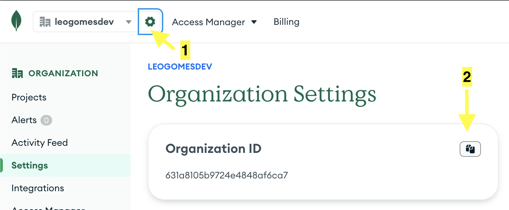

# 🌐 MongoDB deployment using Terraform

## 📚 Description

This project contains examples and instructions for:

1. [Terraform](https://www.terraform.io) general usage
2. Creating [MongoDB Atlas Cluster](https://www.mongodb.com/docs/atlas/getting-started/) using Terraform

Terraform has [several use cases](https://developer.hashicorp.com/terraform/intro/use-cases) in IT Industries.
Both examples on this repository are ready to be used locally on a computer as a demonstration of Terraform usage.
Please refer to the Terraform docs for other use cases of automation of Terraform.

⚠ **Important:** The example on this repo for the MongoDB Cluster creates a *cluster that can be accessed from any IP address in the world (0.0.0.0/0).*
This is just an example use case.
**Do not use the same config in a production environment.**
When running in prod, you must protect your applications and restrict access only to IP addresses or Security Group IDs that are really required.

## 🛠️ Prerequisites

- Clone this repository
  ```bash
  git clone https://github.com/leogomesdev/mongodb-terraform-deployment
  ```
- Install the [Terraform CLI](https://developer.hashicorp.com/terraform/tutorials/aws-get-started/install-cli)
- Prerequisites for **example 1**:
  - [Docker Desktop](https://www.docker.com/products/docker-desktop/) installed and running locally
- Prerequisites for **example 2**:
  - A [MongoDB Atlas Account (Free)](https://cloud.mongodb.com/) with access to manage your desired organization
  - Your organization ID:
    - Go to the Settings page and use the copy button
      
  - API Keys:
    - Go to Access Manager > Organization Access on the menu; then go to the API Keys tab and use the "Create API Key" button; insert a description and select the role **Organization Project Creator**; click on next; copy both values to a safe place
      

**Disclaimer:**

**Free tier cluster creation (M0) is supported** for the [resource mongodbatlas_cluster](https://registry.terraform.io/providers/mongodb/mongodbatlas/latest/docs/resources/cluster).

However, if your organization needs a bigger tier (paid), a payment method may be required for your organization on your Atlas Account.
If this is your case, you could either check [MongoDB Billing information](https://www.mongodb.com/docs/atlas/billing/#view-and-edit-your-billing-profile) for setting up a payment method or integrate payment with your AWS account through [AWS Self-Serve Marketplace](https://www.mongodb.com/docs/atlas/billing/aws-self-serve-marketplace/)

---

## 🐳 Example 1: Using Terraform for docker management

- Access the project folder:
  ```bash
  cd 01-docker-container-example
  ```
- Create a new [Terraform Workspace](https://developer.hashicorp.com/terraform/language/state/workspaces), by running the command:
  ```bash
  terraform workspace new local
  ```
- Prepare your working directory for other commands (install provider plugins):
  ```bash
  terraform init
  ```
- Optionally, show changes required by the current configuration:
  ```bash
  terraform plan
  ```
- Create or update infrastructure:
  ```bash
  terraform apply
  ```
- List Docker containers:
  ```bash
  docker ps
  ```
- Access on the browser: [http://localhost:8000/](http://localhost:8000/)
- Optionally, update _terraform.tfvars_ file, and apply the new changes:
  ```bash
  terraform apply
  ```
- Show the current state:
  ```bash
  terraform show
  ```
- Destroy previously-created infrastructure:
  ```bash
  terraform destroy
  ```
- Show the current state (should be empty now):
  ```bash
  terraform show
  ```

---

## 🌐 Example 2: Using Terraform for MongoDB Atlas Deployment

- Access the project folder:
  ```bash
  cd 02-mongodb-example
  ```
- Define your MongoDB Atlas API Keys as environment variables:
  ```bash
  export MONGODB_ATLAS_PUBLIC_KEY="XX"
  export MONGODB_ATLAS_PRIVATE_KEY="XX"
  ```
- Define your Terraform variables on **terraform.tfvars** file. After copying the example file with the command below, **you must edit the file to add your mongodb_atlas_org_id** and update any desired variable.
  ```bash
  cp -v terraform.tfvars.example terraform.tfvars
  ```
- Create a new [Terraform Workspace](https://developer.hashicorp.com/terraform/language/state/workspaces), by running the command:
  ```bash
  terraform workspace new local
  ```
- Prepare your working directory for other commands (install provider plugins):
  ```bash
  terraform init
  ```
- Create or update infrastructure (skipping interactive approval):
  ```bash
  terraform apply -auto-aprove
  ```
- After the success message, you are ready to use your database. On the MongoDB Atlas website you can get more info about how to connect with your database:
  

- If using mongo shell, just connect with the cluster and run your MongoDB commands:
  ```bash
  mongosh "mongodb+srv://cluster01.<REPLACE>.mongodb.net/myApp" --username "my_user" --password "pass986@41"
  ```
  ```javascript
  db.products.insertOne( { item: "card", qty: 15 } );
  db.products.find();
  ```
- Destroy previously-created infrastructure:
  ```bash
  terraform destroy
  ```

---

### 📝 Docs and external resources:

- [Docs: Create an Atlas Cluster from a Template using Terraform](https://www.mongodb.com/docs/mongodb-vscode/create-cluster-terraform/)
- [Docker Terraform Provider](https://registry.terraform.io/providers/kreuzwerker/docker/latest/docs)
- [MongoDB Atlas Terraform Provider](https://registry.terraform.io/providers/mongodb/mongodbatlas/latest/docs)
